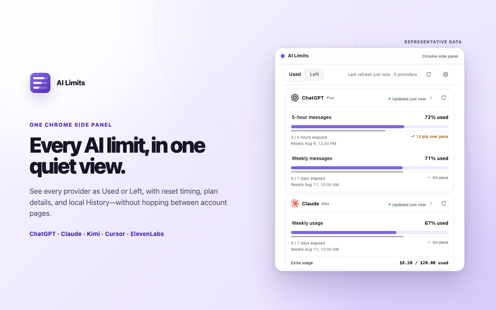

# AI Limits

English | [简体中文](README.zh-CN.md)

[](https://chromewebstore.google.com/detail/ai-limits/hcfdchpajckemcdflcjhigngpipdkdeo)
[](https://github.com/TiantianFlow/ai-limits/actions/workflows/ci.yml?query=branch%3Amain)
[](https://github.com/TiantianFlow/ai-limits/releases/latest)
[](LICENSE)

**[Install from the Chrome Web Store](https://chromewebstore.google.com/detail/ai-limits/hcfdchpajckemcdflcjhigngpipdkdeo)**

Chrome Web Store releases can lag while review or publishing is pending; the
Store badge shows the currently published version. GitHub Releases preserve
the corresponding source and validated upload archive.

AI Limits supports seven providers: ChatGPT, Claude, Kimi, Cursor, Grok, ElevenLabs,
and New API. It is a Chrome side-panel extension that shows their current
subscription usage and local quota-history graphs in one compact view. It
normalizes provider-specific reporting into one **Used** or **Left** display
and, when a provider exposes a complete reset window, compares quota
consumption with elapsed time to show a pace signal. It starts empty and reads
usage only after you connect an individual provider and approve that
provider's optional access.

AI Limits is an independent project by TiantianFlow. It is not affiliated with,
endorsed by, or authorized by OpenAI, Anthropic, Moonshot AI, Cursor, xAI,
ElevenLabs, the New API project, or their affiliates.



## How it works

- Each provider is opt-in. Chrome asks for only that provider's exact host
  access.
- ChatGPT, Claude, Kimi, Cursor, and Grok use the signed-in browser session. The
  extension sends low-frequency, read-only requests to their own web-session
  usage services and does not scrape rendered page content. Cursor's base
  usage refresh remains a background request; Connect or manual Refresh may
  additionally run bundled read-only code in one already-open `cursor.com`
  page to request two fixed dashboard JSON responses.
- ElevenLabs uses a user-created API key because its documented public API does
  not offer the same zero-setup web-session route used by the other providers.
  The extension sends that key only to the ElevenLabs API for its read-only
  subscription request.
- AI Limits supports multiple New API instances. Each instance keeps its own
  normalized base URL, label, relay key, current usage, refresh state, and
  History. Capped keys show quota; unlimited keys show an absolute counter.
  Account wallet, subscriptions, admin data, and other relay keys are not read.
- The latest normalized quota, counter or spend, balance, plan, refresh-status,
  and preference data is stored in Chrome extension storage on the local
  browser profile.
- After each successful normalized refresh, quota, counter or spend, and
  balance observations are stored per instance for up to 30 days, subject to a
  1,024-observation per-instance safety cap. The newest 48 hours stay at
  collection resolution; older retained observations keep the latest value in
  each UTC hour. Version 0.3.0 graphs quota metrics only. It does not graph the
  retained counters or balances, reconstruct earlier provider history, or
  store raw provider responses or credentials in History.
- Browser-session cookies and access credentials are used only for the current
  provider collection attempt and are not saved in persistent extension
  storage. Successfully validated ElevenLabs and New API keys are stored separately in
  local extension storage so manual and scheduled refresh can run without
  reopening the setup page.
- Automatic refresh is enabled by default and runs about every 15 minutes only
  while at least one connected provider remains. It can be disabled in
  Settings.

Kimi scheduled refresh never opens a tab. An interactive Connect or Refresh
may open at most one inactive temporary Kimi tab, waits up to 10 seconds for
recovery, and closes only the tab it created. The extension checks the legacy
Kimi cookie first, then the exact `access_token` entry in an already-open Kimi
page. Browser shutdown or API errors can delay or prevent best-effort cleanup.

Cursor Connect or manual Refresh may use one already-open `cursor.com` tab to
request Grok Bot and extra-credit JSON in the page's same-origin context. AI
Limits does not create or activate a Cursor tab and does not inspect its
rendered content, browser storage, or cookie values directly. Chrome still
attaches the signed-in Cursor cookies to those fixed same-origin requests.
Scheduled or automatic refresh never injects into a Cursor page, so it refreshes
base monthly and on-demand usage without adding new Grok Bot or extra-credit
observations.

ElevenLabs setup opens its official API-keys page in a normal tab. If you need
to sign in first, the guide remains open and lets you reopen that page. It asks
you to create a key with **User → Read** and no generation or write permissions,
then validates the read-only subscription request before saving the key. The
exact endpoint-to-scope mapping is not formally documented by ElevenLabs, so
the connection check is the authority; AI Limits does not silently broaden
permissions. Once connected, ElevenLabs manual and scheduled refreshes run in
the background without opening tabs. See [Privacy](PRIVACY.md) for the saved
key's local-storage boundary and limitations.

See the [FAQ](FAQ.md) for refresh and History behavior,
[Supported providers](SUPPORTED_PROVIDERS.md) for each connection mode and its
limitations,
[Privacy](PRIVACY.md) for the complete data lifecycle, and
[Security](SECURITY.md) for security reporting and limitations.

## Permissions

AI Limits requires `storage`, `alarms`, and `sidePanel` for local state,
scheduled refresh, and its interface. Provider origins are optional and are
requested one at a time when you click **Connect** or validate an API-key
connection. New API declares dynamic optional host capability because it can be
self-hosted, but Chrome is asked only for the exact instance origin entered in
onboarding. Same-origin New API instances share that browser-global grant only;
their credentials, labels, usage, and History remain independent. The optional
`cookies` is requested only for Kimi session access. `scripting` is requested
for Kimi interactive recovery and for Cursor's manual/connect-only page
enrichment. ElevenLabs
receives only optional access to `https://api.elevenlabs.io/*`; the public
setup page is opened normally and does not receive extension host access. The
extension does not request the broad `tabs` permission.

For exact permission justifications and reviewer steps, see the
[store-listing draft](STORE_LISTING.md).

## Local development

Use Node 24 and the Corepack-managed pnpm version pinned in `package.json`.
From the repository root:

```bash
corepack enable
pnpm install --frozen-lockfile
pnpm dev
```

Run the full test, typecheck, build, and build-layout verification:

```bash
pnpm verify
```

## Load unpacked

After `pnpm verify`, open `chrome://extensions`, enable **Developer mode**, and
choose **Load unpacked**. From the repository root, select:

```text
dist/chrome-mv3
```

`pnpm build` stages this visible directory from WXT's generated `.output`
directory, so it appears normally in the macOS file chooser. Use the extension
toolbar action to open the side panel.

## Build the upload ZIP

Create and validate the Chrome Web Store upload artifact with:

```bash
pnpm verify:zip
```

The command rebuilds the extension, creates
`.output/ai-limits-0.4.0-chrome.zip`, opens the archive, and verifies its
manifest, entrypoints, permissions, and forbidden-file rules.

## Provider compatibility

The browser-session providers use private, unsupported session and usage
interfaces. ElevenLabs and New API use documented APIs, but response
shapes, authorization scopes, security challenges, or availability can still
change without notice. AI Limits converts malformed or unavailable responses
into bounded health states, but cannot guarantee continuous compatibility.

## Contributing

Read [CONTRIBUTING.md](CONTRIBUTING.md) before submitting a change. This project
uses [GitHub Issues](https://github.com/TiantianFlow/ai-limits/issues) for public
support and bug reports. Do not include cookies, access credentials, private
usage data, or other secrets in an issue.

## Community

Thanks to [LINUX DO](https://linux.do/) for providing a space for Chinese
developers to exchange ideas and feedback. This acknowledgement does not imply
affiliation or official endorsement.

## License

[MIT](LICENSE) © 2026 TiantianFlow
