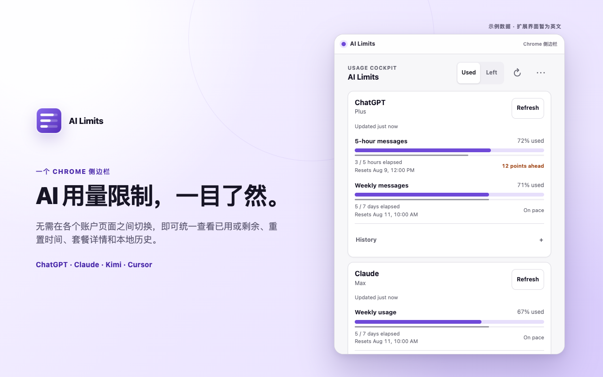

# AI Limits

[English](README.md) | 简体中文

AI Limits 是一款 Chrome 侧边栏扩展，可在一个紧凑的界面中查看 ChatGPT、
Claude、Kimi 和 Cursor 的当前订阅用量及本地配额历史图表。它会将不同服务商
的用量统一为“已用”或“剩余”视图；当服务商提供完整的重置周期信息时，还会将
配额消耗与已过时间比较，显示用量节奏。扩展初始不读取任何数据；只有当你主动
连接某个服务并批准该服务的可选访问权限后，才会读取其用量。

AI Limits 是 wjcjttl 开发的独立项目，与 OpenAI、Anthropic、Moonshot AI、
Cursor 或其关联公司不存在隶属、背书或授权关系。

> 当前扩展界面为英文。下图的中文文字是项目介绍文案；嵌入的实际扩展界面
> 仍为英文。后续完成扩展本身的简体中文支持后，我们会重新生成截图。



## 工作原理

- 每个服务都需要单独启用。Chrome 只会请求该服务的网站访问权限。
- 扩展以较低频率向服务商自己的网站会话用量接口发送只读请求，不会抓取
  页面中渲染的内容。
- 最新的标准化配额、余额、套餐、刷新状态和偏好设置会保存在当前浏览器配置
  文件的 Chrome 扩展本地存储中。
- 每次刷新成功并完成标准化后，扩展会将配额观测值在本地保存最多 30 天，用于
  “History”历史图表；每个服务设有 1,024 条观测的安全上限。受此上限约束，
  最近 48 小时内的观测按采集粒度保留；更早的留存历史只保留每个 UTC 小时内的
  最后一次观测。升级时，一个有效的当前快照可能按其原始获取时间成为第一条
  观测；扩展不会重建更早的服务商历史，也不会记录余额历史。
- 会话 Cookie 和访问凭据仅在本次服务数据收集过程中使用，不会保存到扩展的
  持久化存储中。
- 只要仍有至少一个已连接的服务，自动刷新就会默认开启，并大约每 15 分钟
  运行一次。你可以在“Settings”中关闭它。

Kimi 在你主动点击“Connect”或“Refresh”时可能需要额外的会话恢复步骤。
扩展会先检查旧版 Kimi Cookie，再读取已打开 Kimi 页面中名称完全匹配的
`access_token` 项。如果找不到可用凭据，或 Kimi 拒绝该凭据，交互式恢复
可能会创建一个非活动状态的 Kimi 首页标签页。恢复过程最多等待凭据 10 秒，
随后会尽力关闭由扩展创建的标签页；浏览器关闭或 API 错误可能延迟或阻止清理。
定时自动刷新绝不会创建 Kimi 标签页。

刷新和“History”历史图表的行为请参阅[常见问题](FAQ.zh-CN.md)，完整的数据
生命周期请参阅[隐私说明（英文）](PRIVACY.md)，安全报告方式和限制请参阅
[安全说明（英文）](SECURITY.md)。

## 权限

AI Limits 使用 `storage`、`alarms` 和 `sidePanel`，分别用于本地状态、定时
刷新和用户界面。服务网站来源权限均为可选权限，只有当你点击 **Connect**
时才会逐个请求。可选的 `cookies` 和 `scripting` 权限只用于 Kimi 会话访问
和交互式恢复。扩展不会请求范围更广的 `tabs` 权限。

完整的权限说明和审核步骤请参阅
[Chrome 应用商店文案草稿（英文）](STORE_LISTING.md)。

## 本地开发

请使用 Node 24，以及 `package.json` 中固定版本、由 Corepack 管理的 pnpm。
在仓库根目录运行：

```bash
corepack enable
pnpm install --frozen-lockfile
pnpm dev
```

运行完整测试、类型检查、构建和构建目录验证：

```bash
pnpm verify
```

## 加载未打包扩展

运行 `pnpm verify` 后，打开 `chrome://extensions`，启用
**Developer mode（开发者模式）**，再选择 **Load unpacked（加载已解压的扩展程序）**。
从仓库根目录选择：

```text
dist/chrome-mv3
```

`pnpm build` 会将 WXT 生成的 `.output` 目录暂存到这个可见目录，因此它会在
macOS 文件选择器中正常显示。点击扩展工具栏图标即可打开侧边栏。

## 构建上传用 ZIP

使用以下命令创建并验证 Chrome 应用商店上传文件：

```bash
pnpm verify:zip
```

该命令会重新构建扩展，创建 `.output/ai-limits-0.1.0-chrome.zip`，打开压缩包，
并验证清单、入口文件、权限和禁止包含的文件规则。

## 服务兼容性

各服务的会话和用量接口都是未公开且不受支持的内部接口，其响应格式、安全
验证或可用性可能随时变更。AI Limits 会将格式异常或不可用的响应转换为有界的
健康状态，但无法保证持续兼容。如果服务商未来提供稳定且有文档的 API，应优先
使用该 API。

## 参与贡献

提交修改前请阅读[贡献指南（英文）](CONTRIBUTING.md)。本项目使用
[GitHub Issues](https://github.com/wjcjttl/ai-limits/issues) 提供公开支持和
错误报告。请勿在 Issue 中包含 Cookie、访问凭据、私人用量数据或其他机密信息。

## 许可证

[MIT](LICENSE) © 2026 wjcjttl
